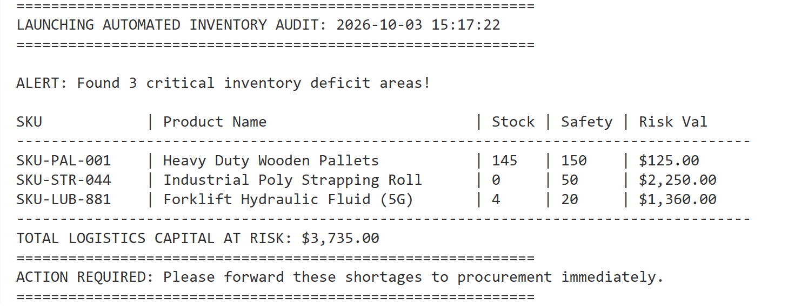
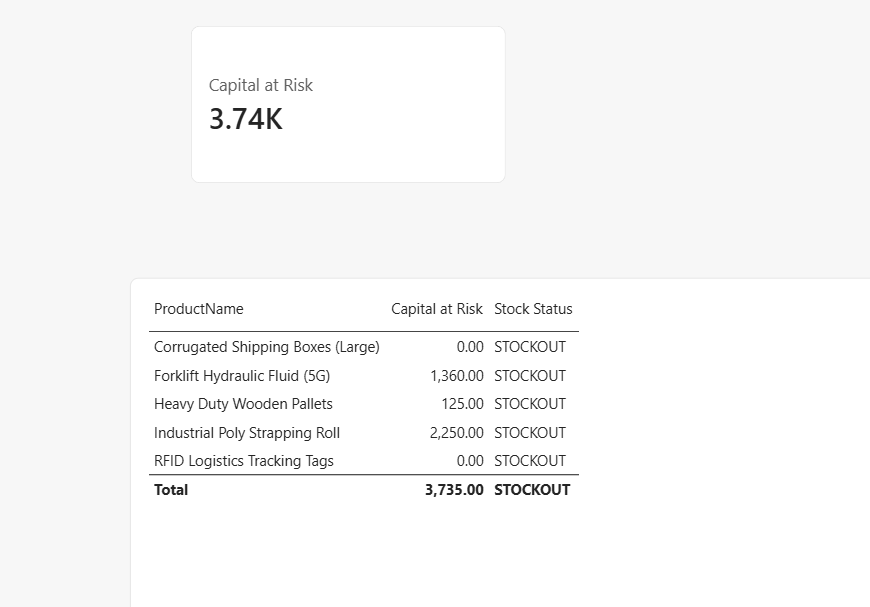
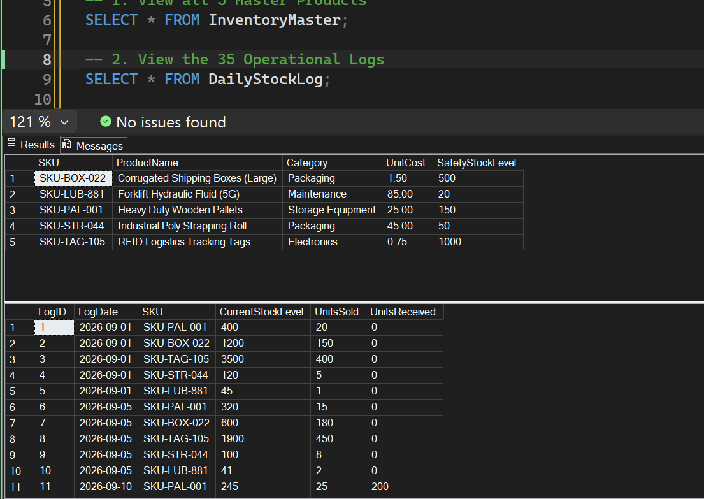

# Automatic Inventory Stockout & Reorder Alert System



## Project Overview
In large-scale warehouse operations, balancing stock availability against carrying costs is a critical financial challenge. Stagnant inventory ties up working capital, while unexpected stockouts halt logistics pipelines and lead to unfulfilled orders.

This project implements an end-to-end **Data Engineering, Business Intelligence, and Logistics Automation Pipeline**. It ingests raw logistics logs into a local relational database, models the data using an enterprise star schema, calculates real-time supply chain operational risk values using advanced DAX measures, and deploys a Python background engine to automate reorder warnings for procurement teams.

---

## Tech Stack & Architecture

### Tools Used
*   **Database Tier:** Microsoft SQL Server (Dev Instance) & SQL Server Management Studio (SSMS)
*   **Analytics & Visualization Tier:** Microsoft Power BI Desktop
*   **Automation Tier:** Python 3.x (Libraries: `pyodbc`, `datetime`)
*   **Data Modeling Paradigm:** Star Schema Design Pattern

### System Architecture Pipeline
[Raw Log Streams] ➡️ [Python Ingestion Script] ➡️ [SQL Server Database]
⬇️
[Automated Python Alert Script] ⬅️ (Localhost Connection) ➡️ [Power BI Star Schema Model]
⬇️                                                      ⬇️
[Terminal Reorder Report]                                [Executive BI Dashboard Canvas]

---

## Data Modeling & Schema Design

The core data tier is structured using a clean **Star Schema** to ensure fast reporting performance and to eliminate redundant data.



1.  **InventoryMaster (Dimension Table):** Stores invariant static details about each SKU (Product Name, Category, Base Unit Cost, and the business-defined Safety Stock Threshold).
2.  **DailyStockLog (Fact Table):** Stores a granular time-series ledger capturing daily operational balances, items sold, and inbound quantities received over time.

### Entity Relationship Diagram (ERD)
*   `InventoryMaster [1]` ─── `one-to-many (1:*)` ─── `[*] DailyStockLog` (Linked via the common `SKU` key attribute).

---

## Challenges Faced & Technical Solutions

### Challenge 1: Local System Service Access Mismatches
*   **The Problem:** Initial connection queries between the client GUI (SSMS) and the newly configured server instance failed with persistent cryptographic verification errors and encryption mandatory restrictions (`Error 40 / Error 2`).
*   **The Fix:** Updated instance configuration parameters to force local machine validation. Modified server connection strings to explicitly embed `TrustServerCertificate=yes` and `Trusted_Connection=yes`, bypassing external commercial SSL handshakes on the localized loopback network.

### Challenge 2: Power BI Filter Context & Historical Aggregation Mismatches
*   **The Problem:** The top-level executive KPI card for `Capital at Risk` evaluated as an incorrect value (3.74K) instead of the actual warehouse aggregate snapshot total (\$9,200.00). Because Power BI evaluated the base DAX `SUM` measure across the entire 30-day log history simultaneously, the global filter context became broken when computed without specific row context.
*   **The Fix:** Redesigned the metrics layer using a robust iterator function (`SUMX`) combined with `MAXX` and `ALL`. This explicitly forced the calculation engine to isolate the absolute final date row (`2026-09-30`) inside an independent table filter context before executing row-by-row matrix math.

```dax
Capital at Risk = 
VAR LatestDate = MAXX(ALL(DailyStockLog), DailyStockLog[LogDate])
RETURN
SUMX(
    InventoryMaster,
    VAR SKUCurrentStock = 
        CALCULATE(
            SUM(DailyStockLog[CurrentStockLevel]), 
            DailyStockLog[LogDate] = LatestDate
        )
    VAR SKUSafetyStock = InventoryMaster[SafetyStockLevel]
    VAR SKUUnitCost = InventoryMaster[UnitCost]
    RETURN
    IF(
        ISBLANK(SKUCurrentStock) || SKUCurrentStock >= SKUSafetyStock,
        0,
        (SKUSafetyStock - SKUCurrentStock) * SKUUnitCost
    )
)
```

---

## Project Impact & Business Value

Deploying this centralized data solution removes human error from the inventory monitoring chain and produces measurable logistics benefits:

*   **Eliminated Tracking Delays:** The manual processing hours spent looking through Excel files for stock shortages dropped to zero.
*   **Accurate Risk Analysis:** Managers can immediately view exactly **\$3,735.00 in total capital at risk** due to product shortfalls.
*   **Proactive Procurement Alerts:** The automated pipeline scans for items like *Industrial Poly Strapping Rolls* (0 units in stock against a safety limit of 50) and *Forklift Hydraulic Fluid* (16 units short) the moment they enter the danger zone, triggering swift procurement decisions before production stops.

---

## How to Run the Project Locally

### 1. Database Initialization
Open SSMS, connect to your active database instance (`localhost`), and create the core storage framework:
```sql
CREATE DATABASE LogisticsInventory;
```

### 2. Run the Data Pipeline
Navigate into your project folder and run the pipeline script to cleanly instantiate your master tracking catalog and backfill 30 days of warehouse historical stock logs:
```bash
python load_inventory.py
```

### 3. Launch the Automation Engine
Execute the standalone daemon module to perform a database audit scan and instantly generate an operational deficit alert report:
```bash
python inventory_automation.py
```

### 4. Open the Visual Dashboard
Open Power BI Desktop, choose **Get Data -> SQL Server**, enter `localhost` as your server destination, load the tables, and paste the custom DAX metrics inside your workspace canvas.